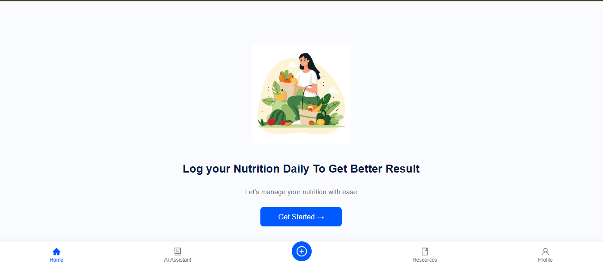
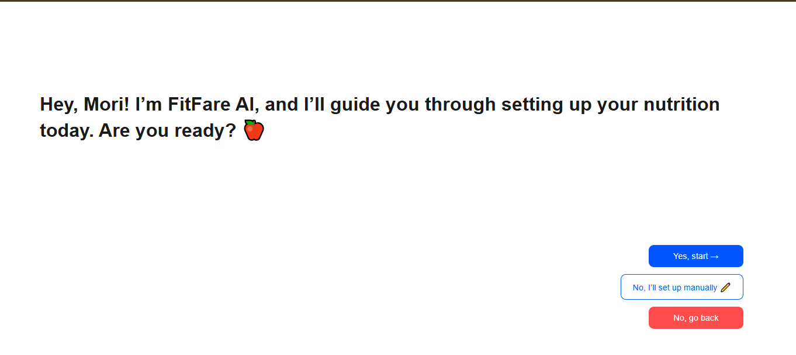
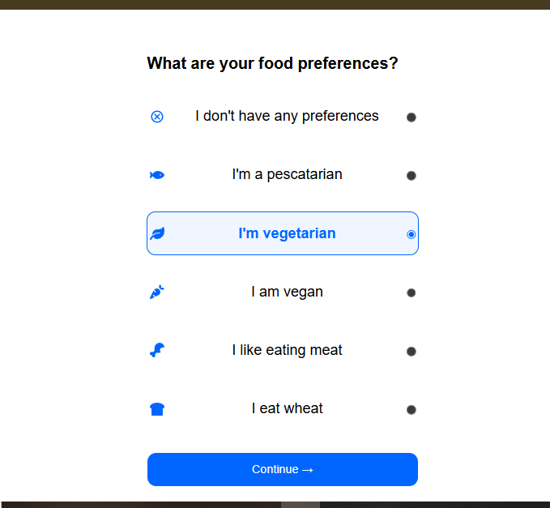
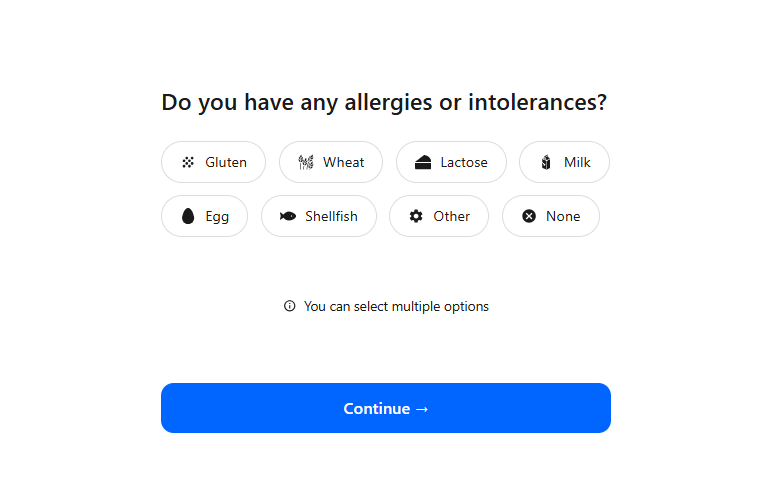
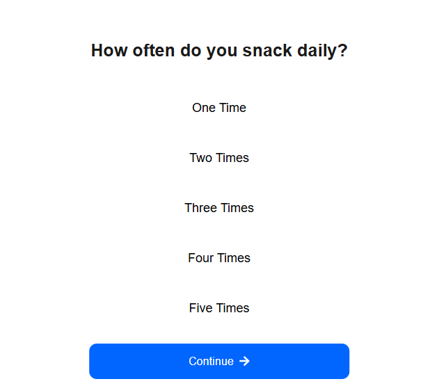

# 🥗 FitFare – Nutrition Setup Module (React + CSS)

### 📘 Overview  
This project is part of my **Full Stack Developer Internship at FitFare Pvt. Ltd.**  
It represents the **Nutrition Setup Flow**, designed to help users personalize their food preferences and dietary needs during onboarding.  

Each page is developed using **React** and **Plain CSS** — clean, professional, and optimized for **laptop displays (no scrolling)**.

---

## 🧩 Pages Included  

| Page Name | Description |
|------------|-------------|
| **Start Page** | Welcome screen that introduces FitFare’s Nutrition AI. |
| **Setup Page** | Initial setup page guiding users through the onboarding steps. |
| **Food Preferences** | Allows users to select their vegetarian or non-vegetarian preferences. |
| **Allergies Page** | Lets users choose from common allergens (with icons) or select “None.” |
| **Snacks Page** | Enables selection of preferred snack frequency. |

---

## ⚙️ Tech Stack  

| Technology | Purpose |
|-------------|----------|
| **React.js** | Frontend framework |
| **React Router** | Smooth navigation between screens |
| **Plain CSS** | Custom styling for each page |
| **React Icons** | Modern icons for intuitive UI |
| **JavaScript (ES6+)** | Page logic and interactivity |

---

## 🖼️ Screenshots  

### 🏁 1. Start Page  

### ⚙️ 2. Setup Page  

### 🍴 3. Food Preference Page  

### 🚫 4. Allergies Page  

### 🍪 5. Snacks Preference Page  

---

## 👩‍💻 Developer Information  

**Name:** Prerana Virbhadra Biradar  
**Role:** Full Stack Developer Intern  
**Organization:** FitFare Pvt. Ltd.  
**Duration:** October 2025  
**Project Title:** Nutrition Setup Module (React + CSS)

---

## 💡 Future Enhancements  

- 🔗 Connect with backend (**Node.js + MySQL**) for real data storage  
- 💾 Implement user authentication and profile integration  
- 📱 Make design responsive for mobile screens  

---

> _A React-based Nutrition Setup Module for FitFare that allows users to personalize their food preferences, allergies, and snack habits through a clean, responsive UI._
