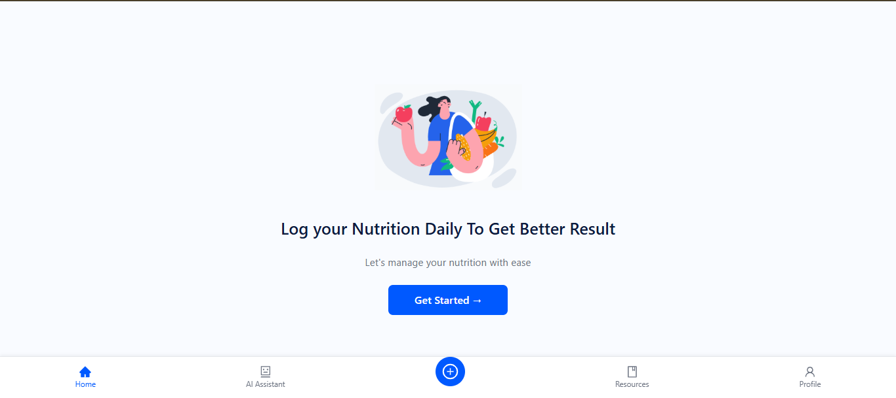
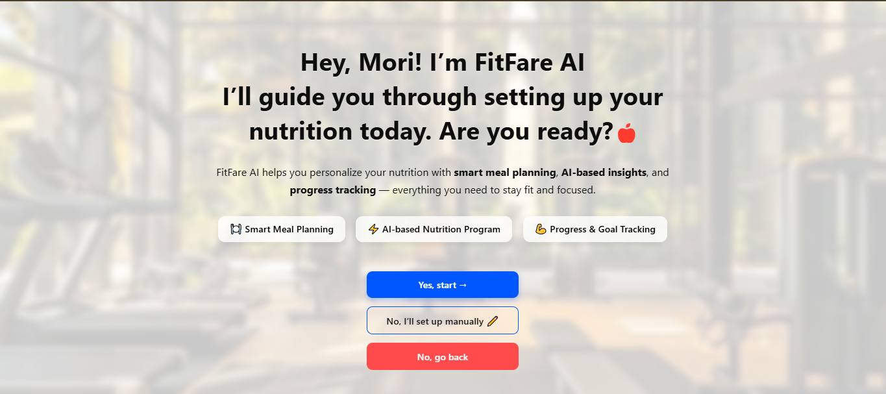
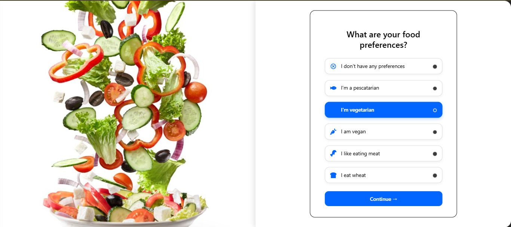
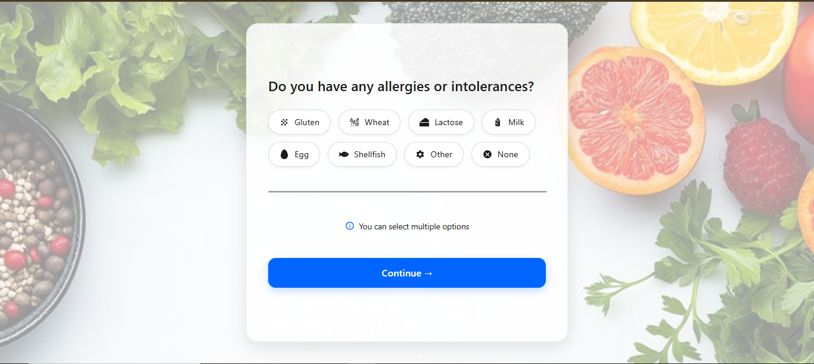
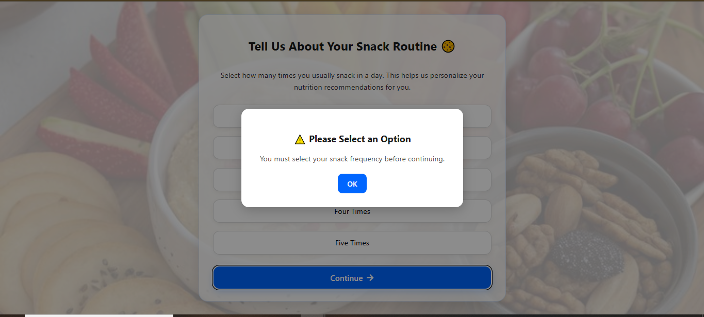
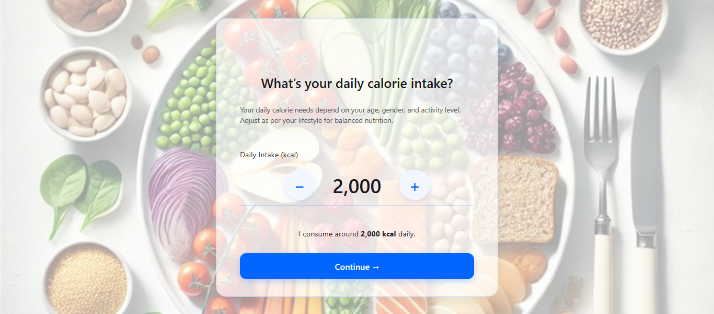
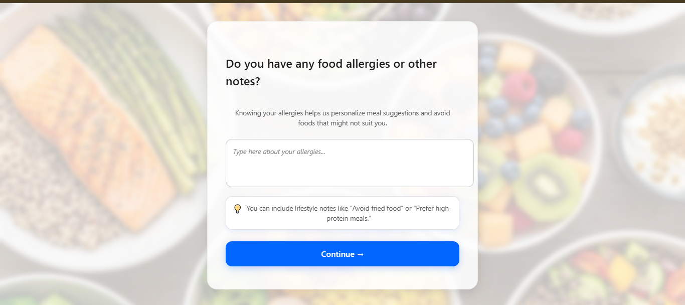

# 🥗 FitFare – Nutrition Setup Module (React + CSS)

### 📘 Overview  
This project is part of my **Full Stack Developer Internship at FitFare Pvt. Ltd.**  
It represents the **Nutrition Setup Flow**, designed to help users personalize their food preferences, allergy details, and snack habits during onboarding.  

Each screen is built using **React** and **Plain CSS**, maintaining a clean, modern, and professional design.  
The layout is optimized for **laptop displays (no scrolling)** to ensure a seamless visual experience.

---

## 🧩 Pages Included  

| Page Name | Description |
|------------|-------------|
| **Home Page** | The landing interface that introduces users to FitFare’s nutrition system. |
| **Start Page** | Welcomes users and initiates the Nutrition Setup journey. |
| **Setup Page** | Displays the setup introduction and onboarding guidance. |
| **Food Preferences** | Allows users to select vegetarian or non-vegetarian meal preferences. |
| **Allergies Page** | Lets users choose or type allergens and dietary restrictions. |
| **Allergies Modal** | Displays selected allergens interactively with a sleek popup interface. |
| **Snacks Routine Page** | Enables users to choose their preferred snack frequency. |
| **Calories Intake Page** | Allows users to input daily calorie goals and preferences. |
| **Food Allergies Summary** | Displays final summary and allergy details before completion. |

---

## ⚙️ Tech Stack  

| Technology | Purpose |
|-------------|----------|
| **React.js** | Component-based frontend framework |
| **React Router** | Handles smooth navigation between pages |
| **Plain CSS** | Custom styling for each screen |
| **React Icons** | Adds clean and modern iconography |
| **JavaScript (ES6+)** | Powers logic and interactivity |

---

## 🖼️ Screenshots  

### 🏠 1. Home Page  

### 🏁 2. Startup Page  

### ⚙️ 3. Setup Page  

### 🍴 4. Food Preference Page  

### 🚫 5. Allergies Modal  

### 🍪 6. Snack Routine Page  

### 🔥 7. Calories Intake Page  

### 🧠 8. Food Allergies Summary  

---

## 👩‍💻 Developer Information  

**Name:** Prerana Virbhadra Biradar  
**Role:** Full Stack Developer Intern  
**Organization:** FitFare Pvt. Ltd.  
**Duration:** October 2025  
**Project Title:** Nutrition Setup Module (React + CSS)

---

## 💡 Future Enhancements  

- 🔗 Backend integration using **Node.js + MongoDB** for real-time data persistence  
- 💾 User authentication and personalized dashboard  
- 📱 Responsive UI for mobile and tablet devices  
- 🌐 Integration with FitFare’s main web application

---

> _A modern React-based Nutrition Setup Module that enables users to personalize dietary preferences, snack routines, and allergy information — built with a clean and engaging UI for FitFare Pvt. Ltd._
